# 🌱 LunaLeaf – Bitki E-Ticaret Uygulaması  

**LunaLeaf**, bitki ve bahçe ürünleri satışı yapan küçük işletmeler için geliştirilmiş modern bir **ASP.NET Core MVC e-ticaret uygulamasıdır**.  
Müşteriler ürünleri görüntüleyebilir, sepete ekleyebilir ve sipariş verebilir.  
Yöneticiler ise admin paneli üzerinden ürün, kategori, marka ve sipariş yönetimi yapabilir.  

---

## 🚀 Özellikler  

✅ **Müşteri Tarafı**  
• Ürün listeleme ve detay sayfası  
• Sepet yönetimi ve sipariş oluşturma  
• Kullanıcı kayıt & giriş sistemi  
• Sipariş geçmişi görüntüleme  

✅ **Yönetici Paneli (Admin)**  
• Ürün, kategori, marka, slider ve kampanya yönetimi  
• Sipariş durumlarını güncelleme (Beklemede, Kargoya Verildi, Teslim Edildi)  
• Kullanıcı ve adres yönetimi  
• İletişim mesajlarını görüntüleme  
• Modern **SB Admin** tabanlı yönetici arayüzü  

---

## 🛠 Kullanılan Teknolojiler  

• **.NET 8 – ASP.NET Core MVC**  
• **Entity Framework Core (SQL Server)**  
• **Cookie Authentication & Authorization Policy**  
• **Bootstrap / SB Admin teması**  

---

## 📸 Ekran Görüntüleri

### Ana Sayfa
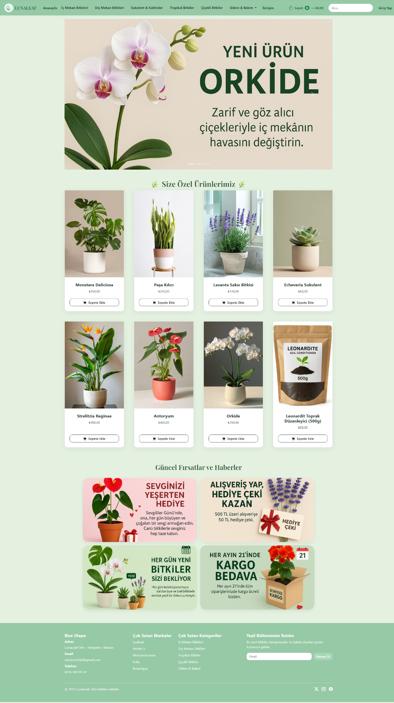

### Kategori Sayfası
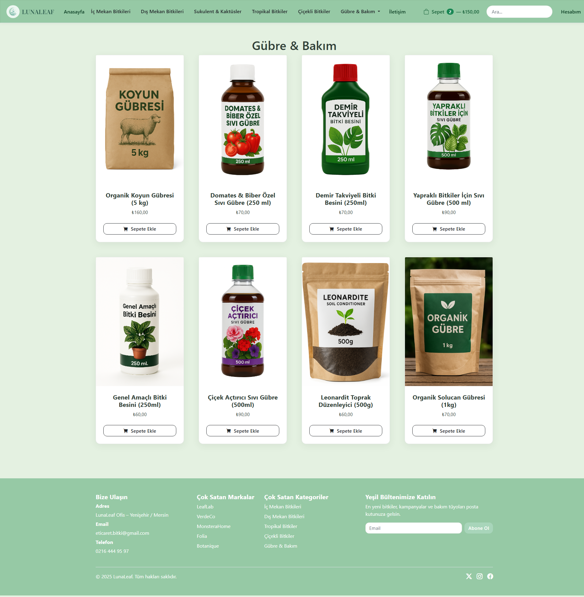

### Ürün Detay
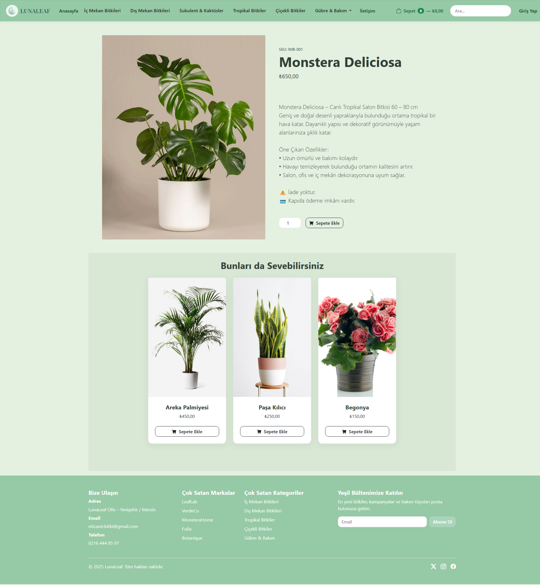

### Sepet
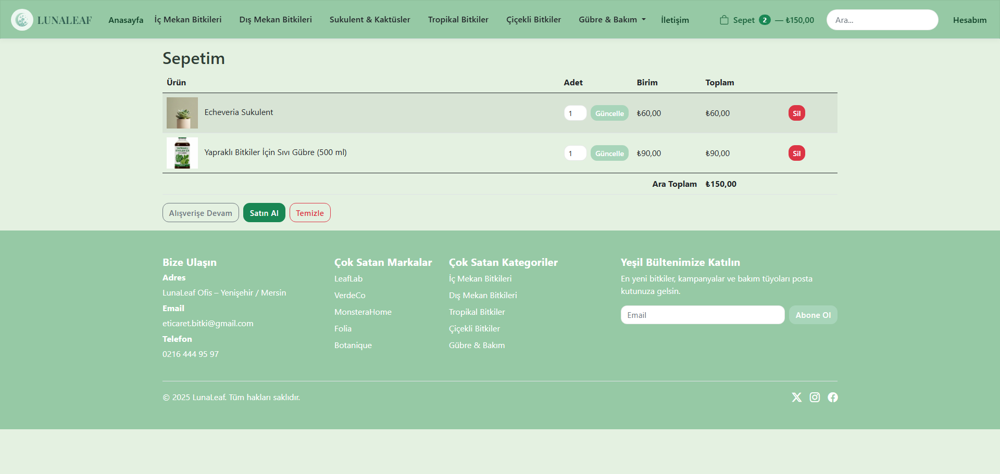

### Ödeme / Checkout
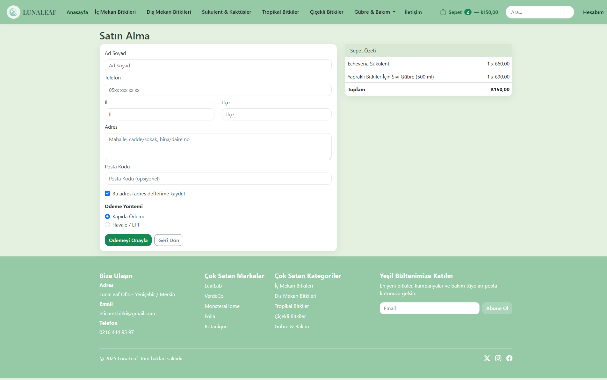

### Giriş Ekranı
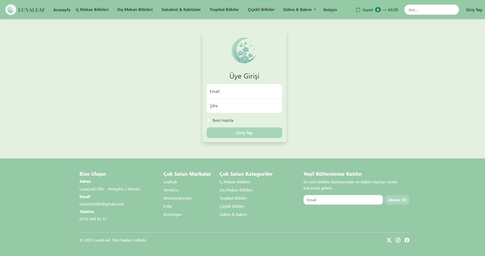

### Kayıt Olma (Sign Up)
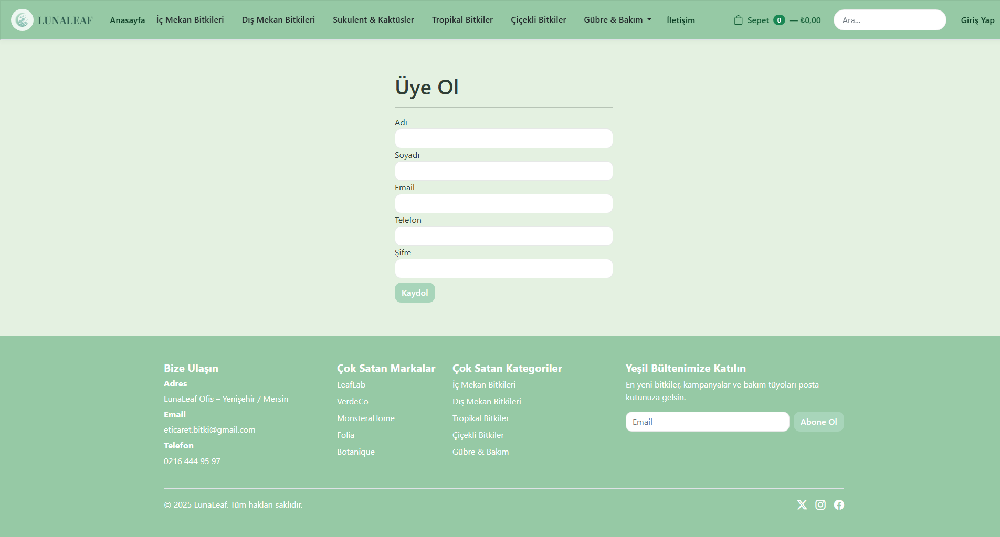

---

## 👨‍💻 Admin Paneli

### Dashboard
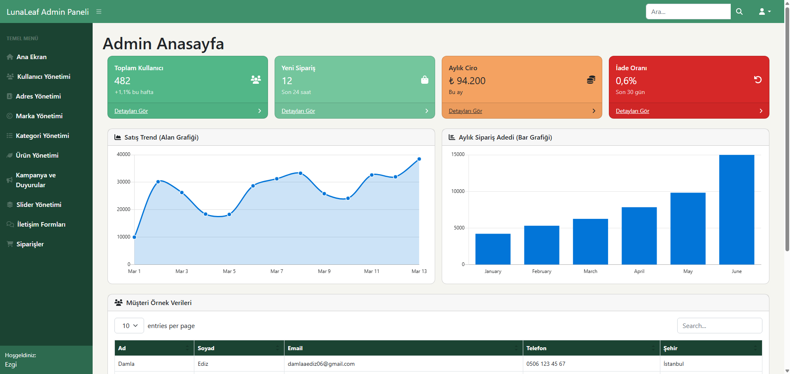

### Ürün Yönetimi
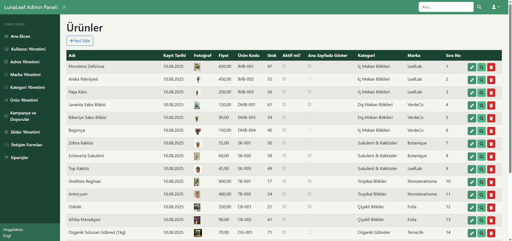

### Sipariş Yönetimi
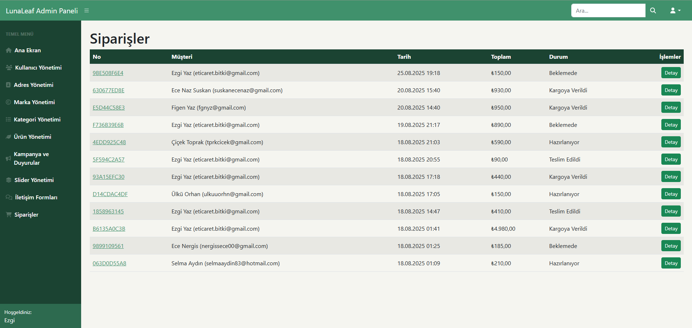

### Sipariş Detay
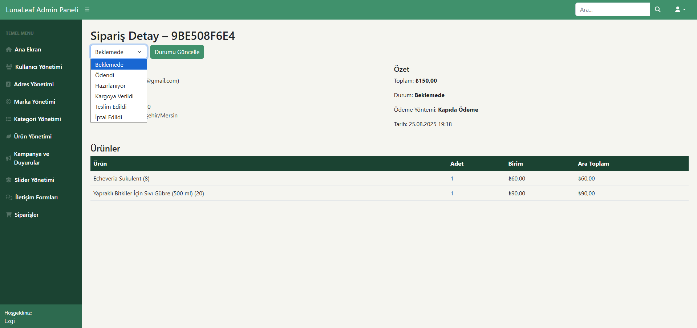

---

## 📌 Not  

📖 Bu proje, **staj kapsamında** geliştirilmiş olup; eğitim ve öğrenim amaçlıdır.  
Profesyonel kullanım için güvenlik ve performans iyileştirmeleri yapılması önerilir.  
